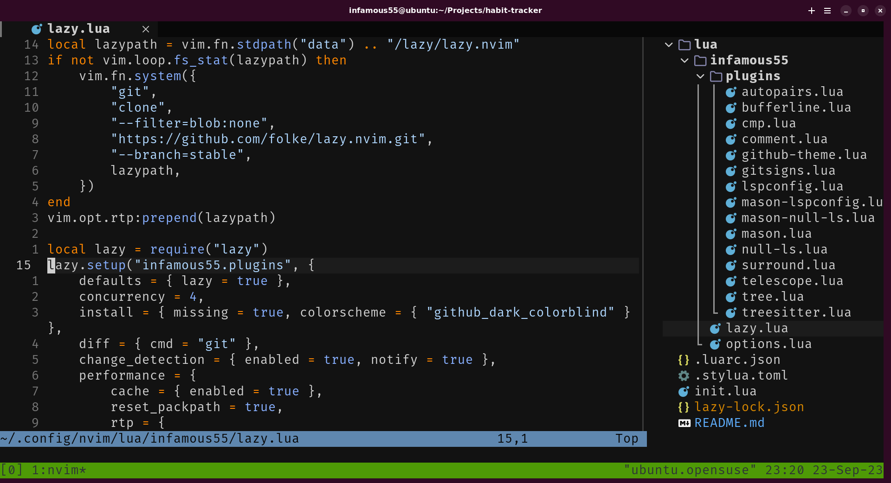

<h1 align="center">
   
  
   
    Configuration
</h1>

  
  

## Overview

This is my personal Neovim configuration, designed to be minimalistic and efficient. It is written in Lua and consists of less than 500 lines of code. I've tailored it to suit my workflow, but you're welcome to use it as a starting point for your own setup.

## Plugins

I'm using the [lazy](https://github.com/folke/lazy.nvim) plugin manager. Here are some of the key plugins I have installed:

- [nvim-treesitter](https://github.com/nvim-treesitter/nvim-treesitter)
- [nvim-cmp](https://github.com/hrsh7th/nvim-cmp)
- [nvim-lspconfig](https://github.com/neovim/nvim-lspconfig)
- [mason.nvim](https://github.com/williamboman/mason.nvim)
- [null-ls.nvim](https://github.com/jose-elias-alvarez/null-ls.nvim)
- [telescope.nvim](https://github.com/nvim-telescope/telescope.nvim)
- [nvim-tree.lua](https://github.com/nvim-tree/nvim-tree.lua)
- [bufferline.nvim](https://github.com/akinsho/bufferline.nvim)
- [gitsigns.nvim](https://github.com/lewis6991/gitsigns.nvim)
- [nvim-autopairs](https://github.com/windwp/nvim-autopairs)
- [Comment.nvim](https://github.com/numToStr/Comment.nvim)
- [nvim-surround](https://github.com/kylechui/nvim-surround)

## License

This repository is licensed under the MIT License. See the `LICENSE` file for details.
